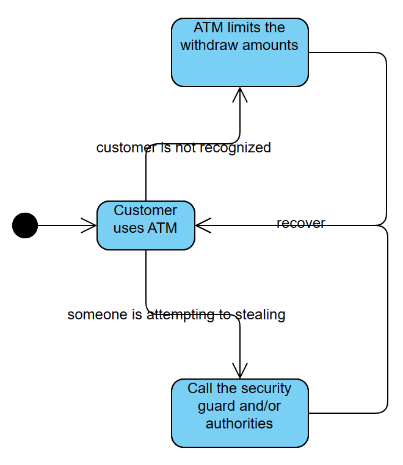

# SE Practice 4 report
name: 刘乐奇
sid: 12011327

Suppose that your team will work on a new ATM security feature for XYZ Bank. The customer wants to use the existing security cameras in the ATMs to automatically detect suspicious activity and take appropriate action. For example, the ATM should limit withdraw amounts if a customer is not recognized or call the security guard and/or authorities if someone is attempting to steal from the machine.

### Q1. Who are the key stakeholders of this new feature?

Bank staff, customer.

### Q2. What are the functional requirements for the new feature?

Face recognition: ATM could recognize the customers using ATM.

Warning: ATM could warn security guard and/or authorities that someone is suspicious.

Authority recognition: ATM could recognize the customer's authority.

Amount limit: ATM could limit the export amount of money.

### Q3. What are the non-functional requirements for the new feature?

Performance: it should be no longer than 5 sec to recognize the customer.

Reliability: the alarm should be punctual and the limit of amount should be followed.

Security: no customer can exceed his authority.

Usability: it is easy to use even for untrained or trained for a short time bank staff.

### Q4. Create an UML diagram to describe the requirements of this new feature. You may choose any type of UML diagrams that you find appropriate to use

